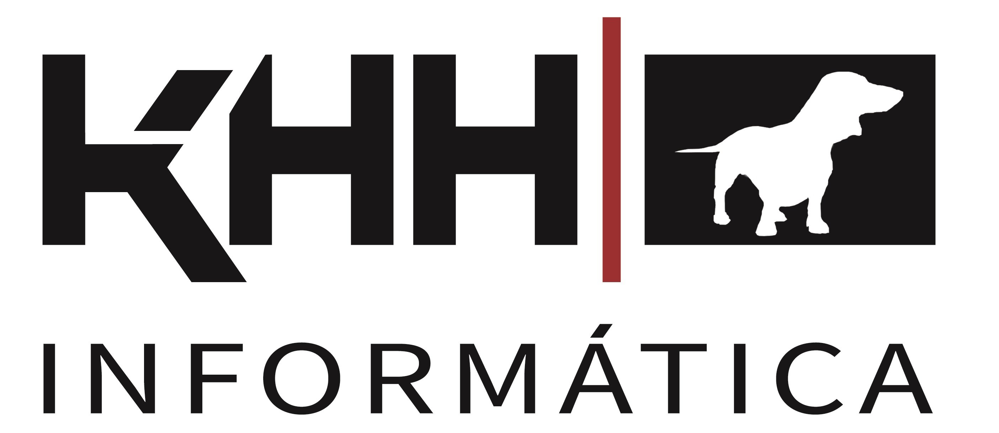

# JUAN LUIS HIDALGO SANCHO

-----------------------------------------
### Experto Freelance en CIENCIA DE DATOS y OPTIMIZACIÓN DE PROCESOS 
### Big Data | Machine Learning | Deep Learning | Artificial Intelligence
------------------------------------------
### FORMACIÓN
* #### INGENIERO DE TELECOMUNICACIONES: ***Universidad Politécnica de Valencia***
* #### BUSINESS AND ENTREPRENEURSHIP: ***University of Cambridge***
* #### INTELIGENCIA ARTIFICIAL y CIENCIA DE DATOS: ***KeepCoding***
* #### DESIGN THINKING Y LEAN STARTUP: ***EDEM Escuela de Empresarios***
-------------------------------------------
### EXPERIENCIA
* #### INDUSTRIA 4.0
* #### MERCADO DE CAPITALES
-----------------------------------------
### HERRAMIENTAS
* #### PYTHON
* #### LINUX
* #### AWS
---------------------------------------------
### CONTACTO
* #### [LINKEDIN]
* #### [E-MAIL]
------------------------------------------
### SOBRE MÍ
"Me considero una persona inquieta, siempre en busca de nuevos proyectos. 
En constante formación, siempre intento estar al día de las nuevas tecnologías
que salen al mercado.
Te invito a que veas alguno de mis proyecto de GitHub"

[LINKEDIN]:https://www.linkedin.com/in/juanluishidalgo/
[E-MAIL]:mailto:jhidalgo@khhinformatica.com
[C.V.]:

